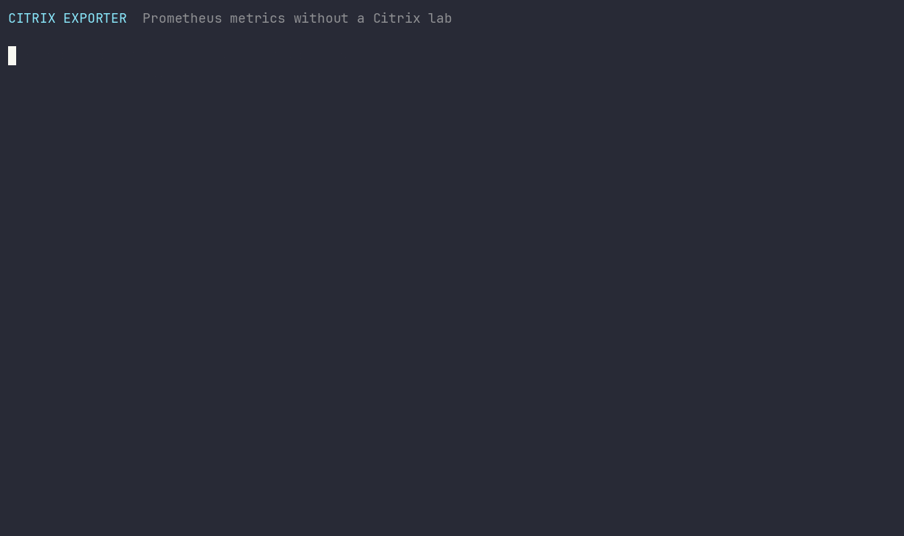

# Citrix Exporter

[](https://github.com/gandara-dev/citrix-exporter/actions/workflows/ci.yml)

A small PowerShell 7 exporter that turns operational data from Citrix Virtual
Apps and Desktops into Prometheus metrics. It covers VDA registration, sessions,
logon duration, license consumption, and MCS catalog capacity.

The included synthetic provider, Prometheus configuration, and provisioned
Grafana dashboard work without a Citrix environment.

> All simulation hostnames, delivery groups, catalogs, features, and values are
> fictional. Never commit production credentials or customer data.



## Why

Citrix health data is often split between product consoles, Broker SDK queries,
and licensing utilities. Citrix Exporter converts a deliberately small set of
high-value signals into a stable Prometheus contract so operators can graph and
alert on them with their existing monitoring stack.

It is intentionally narrow: this is an auditable exporter, not a replacement
for Citrix Director or a general-purpose SDK proxy.

## Architecture



Collection is synchronous: each `/metrics` request queries the selected provider
and returns a fresh snapshot. The exporter does not cache Citrix data or run a
background collection timer.

Read the [architecture guide](docs/architecture.md) for component boundaries,
request lifecycle, failure semantics, and scaling limits.

## Two-minute quick start

Requirements: Docker Desktop or Docker Engine with the Compose plugin.

```powershell
git clone https://github.com/gandara-dev/citrix-exporter.git
cd citrix-exporter
docker compose up --build --detach --wait
Invoke-WebRequest http://localhost:9187/metrics |
    Select-Object -ExpandProperty Content
```

Open:

- Exporter landing page: <http://localhost:9187/>
- Exporter health endpoint: <http://localhost:9187/health>
- Prometheus: <http://localhost:9090>
- Grafana dashboard: <http://localhost:3000/d/citrix-vdi-overview/citrix-vdi-overview>

Grafana permits anonymous viewer access only for this local demonstration. Stop
and remove the stack when finished:

```powershell
docker compose down --volumes
```

## Metrics

| Metric | Type | Key labels | Meaning |
|---|---|---|---|
| `citrix_vdas` | gauge | `delivery_group`, `registration_state` | Current VDA count |
| `citrix_sessions` | gauge | `delivery_group`, `state`, `protocol` | Current session count |
| `citrix_logon_duration_seconds` | gauge | `delivery_group` | Average duration for sessions in the snapshot |
| `citrix_licenses` | gauge | `feature` | Licenses issued by feature |
| `citrix_licenses_in_use` | gauge | `feature` | Current checkouts by feature |
| `citrix_mcs_catalog_machines` | gauge | `catalog` | Machines in each MCS catalog |
| `citrix_exporter_scrape_success` | gauge | none | `1` after a successful collection, otherwise `0` |
| `citrix_exporter_scrape_duration_seconds` | gauge | none | Duration of the most recent collection |
| `citrix_exporter_scrape_errors_total` | counter | none | Failed collections since process start |
| `citrix_exporter_build_info` | gauge | `version`, `mode` | Exporter version and operating mode |

See the [metrics reference](docs/metrics-reference.md) for source fields,
no-data behavior, example PromQL, and compatibility policy.

## Run without Docker

PowerShell 7.2 or newer is required.

```powershell
pwsh ./exporter.ps1 -ListenAddress 127.0.0.1 -Port 9187 -Simulation
```

Inject a controlled collection failure and confirm that the endpoint stays
available while publishing `citrix_exporter_scrape_success 0`:

```powershell
pwsh ./exporter.ps1 `
    -ListenAddress 127.0.0.1 `
    -Port 9187 `
    -Simulation `
    -InjectFailureSource Broker
```

Valid failure sources are `Broker` and `Licensing`.

## Connect to Citrix

Run the exporter on a supported Windows management host where the Citrix Virtual
Apps and Desktops PowerShell SDK is installed. The process account needs only
the Citrix delegated permissions required to read machines, sessions, and
catalogs.

```powershell
pwsh ./exporter.ps1 `
    -ListenAddress 127.0.0.1 `
    -Port 9187 `
    -AdminAddress ddc01.example.test
```

The collector uses `Get-BrokerMachine`, `Get-BrokerSession`, and
`Get-BrokerCatalog`. `-AdminAddress` is passed directly to those commands when
provided.

License metrics are optional. Supply the local Citrix License Server
`lmstat.exe` path and a server name together:

```powershell
pwsh ./exporter.ps1 `
    -AdminAddress ddc01.example.test `
    -LmstatPath 'C:\Program Files (x86)\Citrix\Licensing\LS\lmstat.exe' `
    -LicenseServer license01.example.test
```

Citrix warns that `lmstat -a` can create substantial activity when many licenses
are checked out. Use a conservative Prometheus interval, measure the impact, or
omit licensing arguments. See the official
[Citrix licensing command reference](https://docs.citrix.com/en-us/licensing/11-17-2-56200/license-administration-commands.html).

The exporter has no authentication or TLS. Keep it on a management network,
bind it to loopback when possible, and place an authenticated TLS reverse proxy
in front of it before any remote exposure. Follow the
[operations guide](docs/operations-guide.md) for a production-oriented rollout.

## Failure behavior

- `/health` reports process liveness, not Citrix collection health.
- A successful `/metrics` collection returns Citrix and exporter self-metrics.
- A failed collection still returns HTTP 200 with only exporter self-metrics,
  including `citrix_exporter_scrape_success 0` and an incremented error counter.
- Prometheus `up` therefore distinguishes transport availability; alert on
  `citrix_exporter_scrape_success` for upstream Citrix collection failures.
- Collection is sequential. A slow Broker or licensing call delays that scrape.

## Test

```powershell
Install-Module Pester -RequiredVersion 5.7.1 -Scope CurrentUser -Force -SkipPublisherCheck
Invoke-Pester -Path ./tests/CitrixExporter.Tests.ps1 -CI -Output Detailed
```

CI runs Pester on Windows and Linux, performs PowerShell static analysis, checks
all Mermaid sources, starts the complete Compose stack, validates exposition
with `promtool`, queries Prometheus, and confirms Grafana provisioning. See the
[testing guide](docs/testing.md) for exact local commands.

After `docker compose up`, run the same cross-platform acceptance check used by
CI:

```powershell
./scripts/Test-ComposeStack.ps1 | Format-List
```

## Documentation

- [Architecture](docs/architecture.md)
- [Metrics reference](docs/metrics-reference.md)
- [Operations guide](docs/operations-guide.md)
- [Testing guide](docs/testing.md)
- [Release verification](docs/release-verification.md)
- [Security policy](SECURITY.md)
- [Contributing](CONTRIBUTING.md)

## Project layout

```text
.
|-- exporter.ps1                 Executable entry point
|-- src/CitrixExporter/          PowerShell module and providers
|-- monitoring/                  Prometheus and Grafana provisioning
|-- tests/                       Pester tests
|-- demo/                        Reproducible terminal demo generator
|-- docs/                        Technical documentation and diagrams
|-- compose.yml                  Local synthetic monitoring stack
`-- Dockerfile                   Non-root exporter image
```

## Current scope

Version `0.1.1` supports one synchronous target per exporter process. It does
not provide authentication, TLS, caching, concurrent collection, service
installation, or automatic discovery. These are explicit operational
boundaries, not implicit promises.

## License

[MIT](LICENSE)
