# Architecture

This document describes the component model, data flow, failure semantics, and
trust boundaries of Citrix Exporter `0.1.0`.

## Design goals

- Expose a small, stable set of operational Citrix metrics.
- Collect on demand when Prometheus scrapes the exporter.
- Keep labels bounded to known Citrix dimensions.
- Remain testable without Citrix infrastructure.
- Fail visibly without making the HTTP endpoint unavailable.
- Avoid accepting or persisting Citrix credentials.

## Component model

### Entry point and module

`exporter.ps1` imports the module manifest and forwards command-line parameters
to `Start-CitrixExporter`. The module exports three commands:

| Command | Responsibility |
|---|---|
| `Start-CitrixExporter` | Own the TCP listener and HTTP request lifecycle |
| `Get-CitrixMetricSnapshot` | Select the synthetic or real provider |
| `Get-CitrixMetric` | Collect a snapshot and render Prometheus text |

Private functions normalize provider-specific objects and format the Prometheus
text exposition. Provider objects do not escape into the HTTP layer.

### Real provider

The real provider calls `Get-BrokerMachine`, `Get-BrokerSession`, and
`Get-BrokerCatalog` with `MaxRecordCount = 100000`. When `-AdminAddress` is set,
the same value is forwarded to each Broker SDK command.

The provider projects SDK objects into a minimal internal snapshot:

- machines: delivery group, catalog, and registration state;
- sessions: delivery group, state, protocol, and calculated logon duration;
- catalogs: name, provisioning type, and machine count;
- licenses: feature, issued count, and in-use count.

License collection is optional. When configured, the exporter executes the
specified `lmstat.exe` with `-a`, the selected server, and a five-second tool
timeout, then parses only aggregate feature lines. Both `-LmstatPath` and
`-LicenseServer` are required together.

### Synthetic provider

The synthetic provider returns deterministic fictional inventory. It exercises
the same normalization and rendering path as production data. `Broker` and
`Licensing` failure injection happens before rendering and is limited to
simulation mode.

### HTTP server

The cross-platform server uses `TcpListener` and handles one connection at a
time. Supported routes are:

| Route | Meaning |
|---|---|
| `/` | Static landing page with endpoint links |
| `/health` | Process liveness and current operating mode |
| `/metrics` | Fresh Citrix snapshot plus exporter self-metrics |

Only `GET` is accepted. Unknown paths return `404`; other methods return `405`.
The server closes every connection after one response and does not implement
keep-alive, compression, authentication, or TLS.

## Request lifecycle

1. The listener accepts one TCP client.
2. It reads the request line and headers with a five-second receive timeout.
3. `/metrics` starts a collection timer.
4. The selected provider produces a new in-memory snapshot.
5. The renderer aggregates objects and writes Prometheus text format `0.0.4`.
6. Self-metrics are prepended and the connection is closed.

No Citrix data is cached between requests. The only process state is the failed
collection counter. The exporter does not attach timestamps; Prometheus assigns
the scrape timestamp.

## Failure semantics

A provider or rendering exception is caught at the `/metrics` boundary. The
endpoint returns HTTP 200 with exporter self-metrics only:

- `citrix_exporter_scrape_success 0`;
- the measured failed collection duration;
- an incremented `citrix_exporter_scrape_errors_total` counter;
- `citrix_exporter_build_info`.

This design keeps `up` focused on HTTP reachability. Monitoring must also alert
on `citrix_exporter_scrape_success == 0`. The warning stream records the failure
message without writing metric labels or raw Citrix objects.

Malformed or timed-out HTTP requests are isolated from the listener loop. The
server attempts a generic `500` response and continues accepting new clients.

## Cardinality and performance

Labels are limited to delivery group, registration state, session state,
protocol, license feature, and MCS catalog. Machine names, usernames, session
IDs, IP addresses, and timestamps are intentionally excluded.

Collection cost is proportional to returned machines, sessions, and catalogs.
The implementation is sequential and supports one in-flight request. Production
scrape intervals must be longer than worst-case collection time. A separate
exporter process is required for each independently monitored Citrix site.

`lmstat -a` can be expensive in large licensing environments. Licensing metrics
may be omitted, or the Prometheus interval increased after measuring impact.

## Trust boundaries

- Prometheus is an unauthenticated HTTP client from the exporter's perspective.
- The exporter process inherits the operator or service account's Citrix SDK
  access and local execute permission for `lmstat.exe`.
- Delivery Controllers and the License Server are upstream trust boundaries.
- Warning output is written to the process host's configured log sink.
- No credential parameter, credential file, or secret store is implemented.

The exporter should run on a management host, bind to loopback or a dedicated
management interface, and be exposed remotely only through an authenticated TLS
proxy.

## Deliberate limitations

Version `0.1.0` does not implement concurrent requests, caching, multi-target
query parameters, service discovery, TLS, authentication, Windows service
installation, or automatic retry. These constraints keep the implementation
small and its operational behavior explicit.
